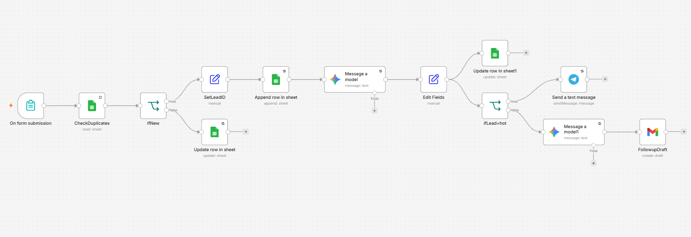

# AI-Powered Lead Generation & CRM Automation

An intelligent n8n workflow that automates lead management by capturing form submissions, checking for duplicates against Google Sheets, classifying leads using Google Gemini AI, triggering instant notifications for hot leads via Telegram, and drafting personalized follow-up emails via Gmail.

## 🚀 Key Features

* **Instant Form Trigger:** Captures inbound lead data from web or form submissions.
* **Duplicate Detection:** Automatically checks existing records by email address to prevent duplicate entries.
* **AI Lead Classification:** Uses Google Gemini to analyze lead intent, categorize priority (`hot`, `warm`, `cold`), and generate a concise summary.
* **Smart Routing & Alerts:** Instantly alerts your team via Telegram if a lead is classified as `hot`.
* **Automated Follow-ups:** Automatically drafts customized email responses via Gmail tailored to the lead's specific inquiry.

---

## 🛠️ Tech Stack & Nodes

* **Automation Tool:** n8n
* **Trigger:** Form Trigger / Webhook
* **Database / Storage:** Google Sheets
* **AI & Processing:** Google Gemini AI Node (`@n8n/n8n-nodes-langchain.googleGemini`)
* **Notifications:** Telegram Bot API
* **Communication:** Gmail API

---

## ⚙️ Workflow Architecture

1. **On form submission:** Inbound lead fills out the contact form.
2. **CheckDuplicates & IfNew:** Verifies if the lead's email already exists in the Google Sheet.
3. **SetLeadID & Append/Update:** Generates a unique `Lead-ID` timestamp and records or updates the lead row.
4. **Message a model (Gemini AI):** Analyzes form details to extract priority, lead type, intent, and summary.
5. **ifLead=hot (Branching):**
   * *If Hot:* Triggers an instant **Telegram alert** and drafts a personalized follow-up email via **Gmail**.
   * *If Normal:* Logs data updates and handles regular processing.

---

## 📦 Setup & Installation

1. Import the sanitized workflow JSON into your self-hosted or cloud n8n instance.
2. Connect your credentials for:
   * **Google Sheets OAuth2 API**
   * **Google Gemini (PaLM) API**
   * **Telegram API**
   * **Gmail OAuth2**
3. Update the Google Sheets Document IDs and Telegram Chat IDs to match your workspace environment.
4. Activate the workflow!
